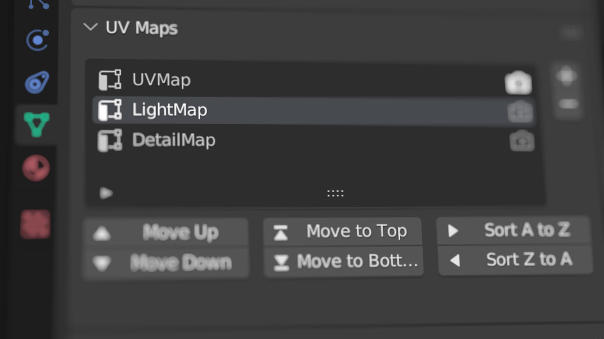

# UV Map Order

Adds buttons to help rearrange and sort UV map orders in Blender.

This is a slight expansion (two more options) and UI revision (more compact) of work by Jake Dube, cdeguise, bovesan, and APEC (which I haven't found here in GitHub). See this [StackExchange discussion](https://blender.stackexchange.com/questions/67266/changing-order-of-uv-maps/) for details, and many thanks to the original authors.

## Installation and Usage

- Download the .py add-on file
- Install in the Blender Preferences > Add-ons tab
- Enable the plugin
- With a mesh selected, you'll find new sorting buttons in the Properties > Data > UV Maps panel

## Options

- `Move Up` - moves the active UV map up by one in the list
- `Move Down` - moves the active UV map down by one in the list
- `Move to Top` - moves the active UV map to the top of the list
- `Move to Bottom` - moves the active UV map to the bottom of the list
- `Sort A to Z` - Alphabetises all UV maps in ascending order
- `Sort Z to A` - Alphabetises all UV maps in descending order

### Notes

- Seems to be working pretty well in Blender 3.6, and should work all the way back to 2.8, but this add-on is provided free and without warranty